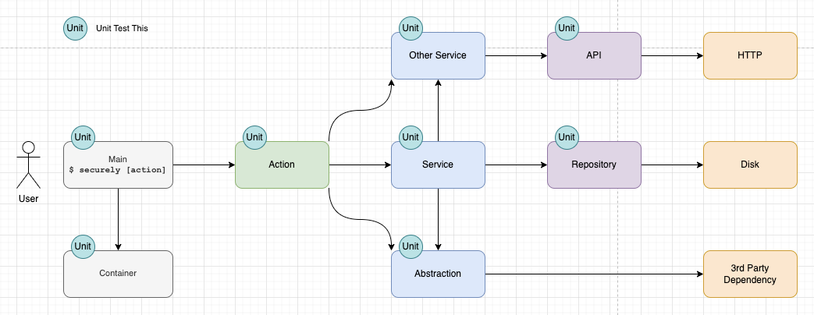

# Contributing to seCurelI - text change

Thank you for making seCureLI better! We look forward to your contribution.

## Pull Requests

This project requires a single approval

We use `python-semantic-versioning` for automated versioning on merges to main. In order for this to work, your PR title must contain the type of change followed by a colon followed by your title.

Like this:
`chore: my PR title`

Valid prefixes are defined in the [angular documentation](https://github.com/angular/angular/blob/main/CONTRIBUTING.md#commit)

# Environment Requirements

## Supported Languages

seCureLI has Slalom-maintained templates for security management of the following languages.

- Java
- Python
- Terraform
- JavaScript
- TypeScript
- C#
- Swift
- Golang

## Python 3.9.9

This repo was started against Python 3.9.9, which released 11/15/2021. Security support will last until 10/05/2025. Newer versions should be fine, older versions will likely not work.

## Setup macOS
As of June 9, 2023, this repo is being built on and tested against macOS 13.4 Ventura.

_Note about the C Compiler: Certain dependencies are implemented as C extensions. Under certain circumstances, you may need to compile the package from sources on your machine. You’ll need a C compiler and Python header files, such as Xcode and Xcode’s command line tools for the Mac, if this is the case. Generally you’ll be guided through this process as you attempt to resolve dependencies (see `poetry install` below)._

___Do no setup for this requirement__ unless prompted to do so, and then follow the instructions given._

- Install Homebrew if needed: https://brew.sh
- Install python `brew install python`
- Install [Poetry](https://python-poetry.org/docs/)
- Install Docker
  - This varies by each individual contributor's environment.
  - Docker Desktop is the simplest
  - The core seCureLI development team uses [Colima - container runtimes on macOS (and Linux)](https://github.com/abiosoft/colima)
- Install Docker buildx cli-plugin
  - This varies by each individual contributor's environment.
  - Docker Desktop is the simplest
  - The core seCureLI development team uses homebrew
    ```shell
    homebrew install docker-buildx
    ln -sfn /usr/local/opt/docker-buildx/bin/docker-buildx ~/.docker/cli-plugins/docker-buildx
    ```
- Restart your terminal
- Jump to [Setup (all Operating Systems)](#Setup-all-Operating-Systems)

## Setup Windows™
Windows™ contributing setup will be coming soon.

## Setup Linux

As of June 9, 2023, this repo is being built on and tested against Ubuntu Jammy 22.04 LTS

- Update apt: `sudo apt update`
- Install git & curl: `sudo apt install git curl`
- (Optional) Install Python: _Ubuntu Jammy comes with Python 3.10 pre-installed_
- Install [Poetry](https://python-poetry.org/docs/)
  - `curl -sSL https://install.python-poetry.org | python3 -`
  - Follow the instructions to add poetry to your shell's $PATH
- Install [Docker & Docker buildx](https://docs.docker.com/engine/install/)

# Setup (all Operating Systems)
- Install BATS (Bash Automated Testing System)
  - `cd $HOME`
  - `git clone https://github.com/bats-core/bats-core.git`
  - `sudo ./bats-core/install.sh /usr/local`
  - `sudo git clone https://github.com/bats-core/bats-support.git /usr/local/lib/bats-support`
  - `sudo git clone https://github.com/bats-core/bats-assert.git /usr/local/lib/bats-assert`
  - Add `export BATS_LIBS_ROOT="/usr/local/lib"` to your shell's configuration file (e.x. ~/.bashrc)
  - Restart your terminal


- Clone the seCureLI repo
  - `git clone https://github.com/slalombuild/secureli.git`
  - `cd secureli`


- Activate a virtual environment using Poetry
  - `poetry shell`
  - This will activate a new virtual environment, and PyCharm should automatically pick this up.
  - To leave this virtual environment, use `exit`, not `deactivate`


- Install your dependencies with Poetry
  - `poetry install`


- Run the tests and calculate code coverage
  - `poe test`
  - Open the `htmlcov/index.html` file to view your coverage report


- Try it out!
  - With the virtual environment still activated, and having installed all dependencies (i.e. `poetry shell && poetry install`), run `secureli` and check out the Usage instructions
  - After the first run, you can run end-to-end BATS tests with `poe e2e`


# PyCharm
- Install [PyCharm Community Edition](https://www.jetbrains.com/pycharm/download/#section=mac)
  - Launch PyCharm and create a new sample project
  - Use the Tools menu and select `Create Command-line Launcher...`
  - Troubleshooting: You may need to create a new project in order to see the Tools menu
  - Perform a one-time configuration of Poetry into PyCharm. Follow the instructions on PyCharm’s website
  - [https://www.jetbrains.com/help/pycharm/poetry.html](https://www.jetbrains.com/help/pycharm/poetry.html)
- Open the new repo with PyCharm
  - `charm .` (assuming you set up the Command-line Launcher above 👆)
  - Say “OK” when prompted to create a poetry environment using pyproject.toml
- From the terminal, either in PyCharm or in the OS Terminal, type `secureli` and press Enter. You should see seCureLI’s documentation appear, with a list of supported commands.

## Create your first Run/Debug Configuration

- At the top-right of the PyCharm window, select the dropdown for managing Run/Debug configurations (it should say “Current File”) and choose “Edit Configurations…”
  - Add a new “Python” run configuration
  - Enter “Init” as the name
  - For Script path, type `secureli/main.py`
  - For Parameters, type `init`
  - For Working directory, use the file browser to select the outer “secureli” folder, NOT the inner folder.
  - **Bad** Example: /Users/[username]/Development/secureli**/secureli/**
  - **Good** Example: /Users/[username]/Development/secureli/
  - It will appear as an absolute path, but hopefully should be relative for others
  - Hit “OK” to save and select your first Run/Debug configuration

## Testing your Init Configuration

- Hit the triangle-shaped Run button next to the dropdown, which should say “Init”
  - If it does not say “Init”, select it in the dropdown
- This should display terminal output within PyCharm that looks like the following:

```jsx
/secureli-LF8LGRWE-py3.9/bin/python secureli/main.py init
seCureLI has not been setup yet. Initialize seCureLI now? [Y/n]:
```

This is a working prompt. If this is your first time running this, answer “Y” (or just press enter) and you’ll install seCureLI for seCureLI! It should detect the python repo and setup your pre-commit hooks. Your output should look like this:

```commandline
% secureli/main.py init
seCureLI has not been setup yet. Initialize seCureLI now? [Y/n]: Y
Detected the following languages:
- Python: 93%
- YAML: 7%
Overall Detected Language: Python
Installing support for Python
pre-commit installed at .git/hooks/pre-commit
Python pre-commit checks installed successfully
```

Running Init a second time should detect that the repo is configured and up-to-date:

```python
/secureli-LF8LGRWE-py3.9/bin/python secureli/main.py init
Already installed for Python language and up to date
```

## Creating the remaining Run/Debug Configurations

- Click the Run/Debug Configuration, which should show “Init” as the selected configuration, and choose “Edit Configurations…”
- With the “Init” configuration shown in the list view on the left, click the Copy Configuration button (or hit Command-D on your keyboard) four times to create four copies of the configuration
- Leaving the original “Init” configuration untouched, adjust the four copies with the following contents:
  - Name: Scan
  - Parameters: `scan`
  - Name: Update
  - Parameters: `update`
  - Name: build
  - Parameters: `build`
- Test each of these configurations and see that the expected “not yet implemented” message is shown

# Building seCureLI Docker Containers behind a corporate proxy
If you receive SSL/TLS untrusted certificate errors when building the Docker images,
chances are your organization's digital security team is using a proxy to monitor your encrypted internet usage. To build
the seCureLI Docker images you will need to inject your organizations self-signed root CA certificate into the images
at build time. To do this, simply place the root certificate (*.crt format) into the `ca-certificates` directory of this
repository.  Everything in the ca-certificates directory will be picked up and trusted by the images built.

# seCureLI Architecture



seCureLI’s architecture, including actions, services, APIs and repositories. Oh, my!

## Main

The entry point of the application. The main module sets up the dependency injection container, validates the input via the Typer framework and identifies and executes a single action. Main is the only module in the system aware of the Container.

Unit tests of Main simply ensure that the Container is set up and leveraged to kick off Actions.

## Container

The container is where all potential dependencies are registered and wired up. Configuration is read here, and is fed into various objects as necessary. Though Main is the only module that is aware of the Container, the Container is aware of every Module.

Unit tests of the Container ensure that the various providers are validated and initialized. This helps prevent common mistakes where dependencies are manipulated but the Container’s wire-up code was not adjusted accordingly.

## Actions

Actions orchestrate other services and respond to user interactions with seCureLI. One CLI command is handled by a single Action, and a single action only handles one command. They are one for one.

Unit tests of Actions are done with mock services and abstractions.

## Services

Services represent a single responsibility and some light interaction with other services. These can be simple, like the Echo Service, which enables the app’s actions and services to print output to the console. A complex service like the Language Analyzer Service leverages the Repo Files Repository, the Lexer Guesser and the Echo Service to analyze a repository's languages.

Services do not leverage 3rd Party or External Dependencies directly, not even the disk. Services may leverage other services as well as abstractions.

Unit tests of Services are done with mock services and abstractions.

## Abstractions

Abstractions are mini-services that are meant to encapsulate a 3rd-party dependency. This allows us to mock interfaces we don’t own easier than leveraging duck typing and magic mocks while testing our own logic. This also allows us to swap out the underlying dependency with less risk of disruption to our entire application.

Abstractions should ONLY provide this wrapping, and no other business logic, unless that business logic is part of the abstraction and leverages the abstraction itself (see `EchoAbstraction` for an example of this)

Please note: this can become unwieldy fast. If your CLI is to extensively leverage a large 3rd party dependency, and is unlikely to swap out this functionality, then it’s a judgment call of the author or team to not create an abstraction of this library. This author trusts your judgment and assures you that you will not be jailed or fined.

Unit tests of Abstractions are done with mock 3rd party dependencies, not the dependencies themselves!

## APIs & Repositories

Objects that provide **faithful** representation of the underlying system without additional business logic or opinions. This does not have to be an exhaustive implementation. In other words, if the API hosts 30 endpoints for Store CRUD operations, and you only need one (i.e. GET /stores), then you can implement the one. However, GET /stores will take a StoreRequest object and return a StoreResponse object (as defined by the Store API OpenAPI documentation).

Preferably, APIs and Repositories will surface entity objects that programmatically represent the underlying object, such as a Pydantic data model or a dataclass and NOT dictionaries!

**The API will not** decide to expose it as a class that takes a store name property and creates its own request that represents a store name search. That’s a service’s job.

**The API will not** apply caching behavior. That’s a service’s job.

**The API will not** orchestrate or chain multiple requests together. That’s a service’s job.

Hopefully you’re seeing a pattern here. At some point in an application, an object exists that faithfully represents a dependent system. One call to the API will be one HTTP request in terms derived from (preferably dictated by) the API itself, no exceptions.

Unit tests of APIs and repositories are done with mock 3rd party dependencies to ensure the translation logic of the API is working.

## Third Party Dependencies

Any library provided via PyPI should be considered a 3rd party library. Examples: Typer, Pygments, etc.

Third party dependencies **shall not be unit tested**, but efforts will be taken to unit test their consumers by mocking these dependencies. Traditionally, this will take the place of creating and leveraging Abstractions (see above).

### Dockerfiles

Docker is used in this project solely to provide an isolated environment for testing Secureli and testing other projects with Secureli. The process is:

- run the docker command to build it
- if it builds successfully, congrats you're done

The project assumes you have a functioning docker install. These have been tested with the Colima engine. There are commands built into the pyproject.toml file to run these dockerfile builds. To build one, run `poetry run poe docker-build-dockerfilename`.

Current Dockerfiles

- Dockerfile_secureli - builds secureli and runs the same tests and verifications as the cicd pipeline
- Dockerfile_homebrew: Designed to verify secureli functionality
  - installs Homebrew(linuxbrew) on a Debian images
  - taps our private secureli homebrew tap
  - installs Secureli
  - Checks out the public pip repo, inits secureli into the repo and runs a scan
- Dockerfile_pypi
  - installs pip
  - installs Secureli
  - Checks out the public pip repo, inits secureli into the repo and runs a scan

# Contributors
A special thanks to everyone that has contributed to seCureLI so far:
- Jon Allegre
- Dan Arnold
- Nava Atluri
- Max Aussendorf
- Chris Ball
- Sascha Bates
- Elliot Benjamin
- Joel Carpenter
- Raul Centeno
- Sucha Chantaprasopsuk
- Alex Diehl
- Korey Earl
- Martin Gallegos
- Ryan Graue
- Jordan Hill
- Kira Hollerman
- Myung Kim
- Tristan Leonard
- Gabe Negron
- Hartono Ramli
- Jeff Schumacher
- Caleb Tonn
- Josh Werner
